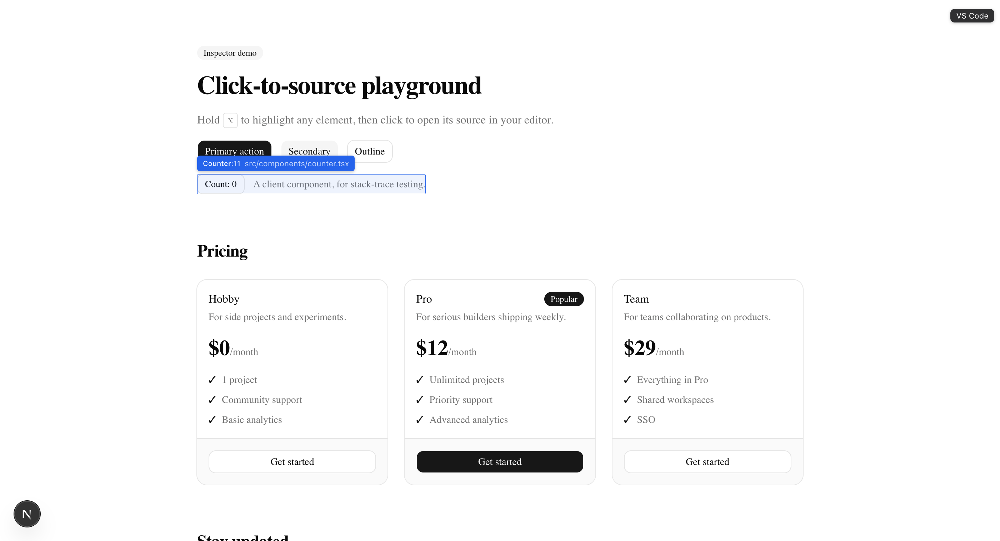

# open-in-code-editor

Click-to-source inspector for **Next.js** and **Vite** React apps. Hold
<kbd>⌥ Option</kbd> to highlight any element in your running dev server — a
label shows the component name, line, and source file — then
<kbd>⌥ Option</kbd>+click to open that exact location in your editor.



- **Source or usage**: <kbd>⌥ Option</kbd>+click opens the component that
  renders the element (its definition); add <kbd>⇧ Shift</kbd> to jump
  instead to where that component is *used* on the page. The label turns
  violet and reads "usage" while Shift is held, so you can see where a
  click will land before you click.
- Works with Server and Client Components on Next.js, and any React component
  on Vite (React 19)
- Opens VS Code, VS Code Insiders, Cursor, Windsurf, or Zed via their URL
  schemes — pick one in the floating selector shown while inspecting
- Zero build config: it reads the source maps your dev server already
  produces — Next.js's stack-frame endpoint, or the inline sourcemaps Vite
  serves with every module — and renders nothing in production builds

## Supported frameworks

| Framework | Status |
| --- | --- |
| **Next.js 16** (Turbopack, default `.next` distDir) + React 19 | ✅ Supported |
| **Vite + React** (`@vitejs/plugin-react`, React 19) | ✅ Supported |

More frameworks to follow. Run the installer outside a supported project (no
app-router `layout.tsx/jsx`, and no `vite.config.*` with a `src/main.tsx` entry)
and it leaves your files untouched — it prints what it expects and exits.

## Install

From your project root — it auto-detects Next.js or Vite:

```bash
npx open-in-code-editor
```

It copies the inspector into your project with a **relative import** (no `@/*`
alias required) and wires your entry file for you:

- **Next.js** — wires `app/layout.tsx` to render `<Inspector/>` inside `<body>`.
  Start your dev server, hold <kbd>⌥</kbd>, hover, and click.
- **Vite** — wires `src/main.tsx`, and writes a gitignored `.env.local` with
  your project root so editor deeplinks resolve to absolute paths.
  **Restart the dev server** afterward so Vite loads `.env.local`, then hold
  <kbd>⌥</kbd>, hover, and click.

The command is idempotent — it skips files that already exist and never edits
your entry file twice.

### Updating

To pull a newer version of the inspector into a project that already has it,
re-copy the files with `update` (the install skips existing files, so a plain
re-run won't refresh them):

```bash
npx open-in-code-editor@latest update
```

That overwrites the `inspector/` folder (and the Next.js API route) with the
latest version while leaving your entry-file wiring alone. `--force` is an alias
for `update`. It's a copy-in tool, not a dependency, so there's nothing for
`npm update` to act on.

### What it adds

**Next.js:**

```
your-app/
  (src/)app/layout.tsx               # + import and a dev-only <Inspector/>
  (src/)inspector/                   # Inspector.tsx, fiber.ts, source.ts, ui.tsx
  (src/)app/api/inspector/route.ts   # optional: install-aware editor picker
```

**Vite:**

```
your-app/
  src/main.tsx        # + a dev-only <Inspector/> mount
  src/inspector/      # Inspector.tsx, fiber.ts, source.ts, ui.tsx
  .env.local          # + VITE_INSPECTOR_ROOT (gitignored; project root for deeplinks)
```

**Requirements:** React 19 in dev mode, plus either a Next.js 16 dev server
(Turbopack, default `.next` distDir) or a Vite dev server using
`@vitejs/plugin-react`.

### Manual install

If you'd rather not run the installer, copy the `inspector/` folder into your
app and render `<Inspector/>` from your entry file yourself (adjust the relative
import path to where you placed the folder):

- **Next.js** — inside `<body>` in `app/layout.tsx`:

  ```tsx
  import { Inspector } from "../inspector/Inspector"
  {process.env.NODE_ENV === "development" && (
    <Inspector projectRoot={process.cwd()} />
  )}
  ```

  The API route is optional — without it a static editor list is shown instead
  of only the editors installed on your machine.

- **Vite** — in `src/main.tsx`, plus `VITE_INSPECTOR_ROOT=<abs project root>`
  in a (gitignored) `.env.local`:

  ```tsx
  import { createRoot } from "react-dom/client"
  import { Inspector } from "./inspector/Inspector"
  if (import.meta.env.DEV) {
    const el = document.createElement("div")
    document.body.appendChild(el)
    createRoot(el).render(
      <Inspector projectRoot={import.meta.env.VITE_INSPECTOR_ROOT} />,
    )
  }
  ```

## Try the demo

This repo is a runnable Next.js demo:

```bash
pnpm install
pnpm dev
```

Open http://localhost:3000, hold <kbd>⌥</kbd>, hover, click.

## Notes

The editor picker appears top-right while inspecting; your choice persists in
localStorage. The **Auto** option defers to the dev server's own editor
detection instead of a URL scheme — Next.js's launch-editor
(`REACT_EDITOR`/`EDITOR`), or Vite's built-in `/__open-in-editor`
(`LAUNCH_EDITOR`/`EDITOR`). On Vite the picker always shows the full editor
list (there's no install-detection route); if `VITE_INSPECTOR_ROOT` isn't
loaded, every editor choice falls back to Vite's `/__open-in-editor` — which
picks the editor itself, so your selection can't be honored and the inspector
logs a console warning saying so. That happens when the dev server wasn't
restarted after install, and for teammates who pulled the wired entry file
but don't have the (gitignored) `.env.local` — fix either by running
`npx open-in-code-editor` and restarting the dev server.

## How it works

React 19 removed `element._debugSource`, which older click-to-code tools
relied on. This inspector instead walks the fiber `_debugOwner` chain and
parses each owner's `_debugStack` — an `Error` whose stack points at the JSX
call site in compiled code — then maps those frames back to your `src/` files:

- **Next.js** asks the dev server's `/__nextjs_original-stack-frames` endpoint
  to source-map the frames; client-chunk frames are rewritten to their on-disk
  `.next/dev/static/` twins so they resolve too.
- **Vite** has no such endpoint, so the inspector fetches each dev module a
  frame points at and decodes its inline sourcemap in the browser (a tiny
  vendored VLQ reader) — no plugin, no config.

Opening the editor is a plain `vscode://file/<path>:<line>:<column>`-style
deeplink fired from the browser (the Vite build gets the absolute path from
`VITE_INSPECTOR_ROOT`).

Because the whole owner chain resolves — innermost (the element's own
definition) through outermost (where it's used on the page) — a plain click
opens the first and <kbd>⇧ Shift</kbd>+click opens the last.

## Uninstall

Delete the `inspector/` folder and remove the inspector import and mount from
your entry file (`layout.tsx` or `main.tsx`). On Next.js also delete
`app/api/inspector/route.ts`; on Vite also remove `VITE_INSPECTOR_ROOT` from
`.env.local`.

## Development

`src/inspector/` is the single source of truth; `templates/` (what the
installer ships) is generated from it — the shared files plus `source.next.ts`
and `source.vite.ts`, which the CLI copies in as `source.ts`. After editing the
inspector, run:

```bash
pnpm sync-templates
```
